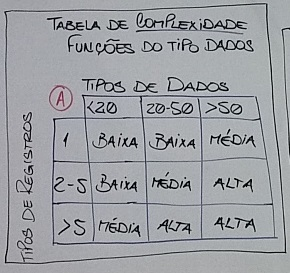

Análise de pontos de função é uma métrica desenvolvida pela IBM na década de 70 cuja principal característica é a identificação do tamanho funcional de um sistema sob a _perspectiva exclusiva do usuário final da aplicação_.

Para a medição de um projeto a APF considera 2 itens básicos: **funções do tipo dados** e **funções do tipo transação**.

A. **Funções do tipo dados**: referem-se à medição da camada de persistência do sistema, que é dividida em dois tipos de arquivos - **arquivos lógicos internos (ALI)** e **arquivo de interface externa (AIE)**.

A.1. **Arquivos lógicos internos (A)**: referem-se ao conjunto de dados manipulado* pela aplicação que está sendo contada e é parte integrante do sistema. São exemplos de ALI: 

A.1.1. arquivos de configuração do sistema lidos e/ou atualizados pela aplicação que está sendo contada

A.1.2. arquivos de senhas manipulados pela aplicação

A.1.3. tabelas de banco de dados em sistemas gerenciadores de banco de dados relacionais (SGBDRs)

A.1.4. arquivos hierárquicos em sistemas gerenciadores de banco de dados em redes 

Não são exemplos de ALIs: arquivos de backup do sistema, arquivos de comunicação intrasistemas (remessa/retorno), arquivos de índices em bancos de dados relacionais, tabelas de relacionamento em SGDBRs (entidades fracas)

A.2. **Arquivos de interface externa (AIE)**: referem-se aos arquivos manipulados* pela aplicação que está sendo contada, porém não são parte integrante do sistema, ou já encontravam-se prontos de outra aplicação.
Os exemplos de AIE são os mesmos ALI acima.

###### *inclusão, pesquisa, consulta, alteração e exclusão - que pode ser física ou lógica.

#### CÁLCULO DA COMPLEXIDADE DA FUNÇÃO DO TIPO DADOS

|   (B)   | Baixa  |  Média  |  Alta   |
|   ---   |  ---   |   ---   |   ---   |
| **ALI** | 7 P.F. | 10 P.F. | 15 P.F. |
| **AIE** | 5 P.F. | 7 P.F.  | 10 P.F. |

###### TD: tipos de dado; TR: tipos de registro; C: complexidade; PF: pontos de função

#### CONTAGEM DE FUNÇÕES DO TIPO TRANSAÇÃO 
Para o desenvolvimento de um sistema, além da contagem de seus dados (persistência = registrar, armazenar) dizem respeito às operações que serão realizadas pelo software para a manipulação dos dados, categorizadas em 3 tipos:

Entradas externas: referem-se às operações de inclusão, alteração e exclusão (física ou lógica).

Saídas externas: referem-se às operações de extração de dados do sistema que utilizam-se de cálculos matemáticos e/ou processamento computacional apurado.

Consultas externas: referem-se às operações de extração de dados da aplicação que está sendo contada sem utilizar-se de cálculos matemáticos ou processamento computacional apurado.
Para a medição da complexidade das funções de transação duas características são observadas: 

**Tipos de dados para função do tipo transação**: referem-se aos atributos (campos) da transação que está sendo contada reconhecidas pelo usuário.

**Arquivos referenciados**: dizem respeito à todo e qualquer ALI/AIE manipulados* pela aplicação que está sendo contada.

###### *inclusão, pesquisa, consulta, alteração e exclusão - que pode ser física ou lógica.

Funções Transações 

| Nome | Tipo | TD | AR | C | PF |
| --- | --- | --- | --- | --- | --- |
| Cadastro de pessoas | Entrada | 13 | 2 | Média | 4 P.F. | 
| Alteração de pessoa | Entrada | 10 | 2 | Média | 4 P.F. |

###### TD: tipos de dado; AR: arquivos referenciados; C: complexidade; PF: pontos de função

Até a década de 1980 a técnica de análise de pontos de função somente levava em consideração o cálculo das funções do tipo dados (ALI/AIE) e as funções do tipo transação (entrada, saída e consulta) sob a perspectiva do usuário.

Neste momento foram introduzidas à técnica 14 características ambientais do sistema com o objetivo de quantificar a complexidade do sistema que até então era ignorada. As 14 características gerais do sistema (14CGS) têm o objetivo de calcular o fator de ajuste (FA) que pode incrementar ou decrementar a quantidade de pontos de função calculada em até 35%. Para cada CGS o analista deverá dar uma nota de influência conforme a tabela abaixo: 

Tabela de influência (F)**

| Influência | Nível de influência |
| --- | --- |
| 0 | Nenhuma influência |
| 1 | Influência mínima  |
| 2 | Influência moderada |
| 3 | Influência média |
| 4 | Influência significante |
| 5 | Total influência |

Após medir as 14CGS aplica-se a fórmula abaixo para o cálculo do fator de ajuste: 

Fator de ajuste = 14CGS * 0.01 + 0.65

Após calcular o fator de ajuste com a fórmula acima calcula-se a quantidade de pontos de função ajustados (PFA): *PFA = PFNA * FA*

### Exercícios 

Considere a tela de geração de relatórios contábeis anexada que refere-se à um relatório simples gerado ao usuário que lê os seguintes arquivos (todos internos à aplicação que está sendo contada): recibo, itensrecibo, fluxocaixa, auditoria; e contabilize a quantidade de pontos de função não ajustados desta transação.

#### Funções dados

| Nome | Tipo | TD | TR | C | PF |
| --- | --- | --- | --- | --- | --- |
| Recibo | ALI | 9 | 3 | Baixa | 7 P.F. | 
| ItensRecibo | ALI | 8 | 5 | Baixa | 7 P.F. |
| FluxoCaixa | ALI | 11 | 8 | Média | 10 P.F. |
| Auditoria | ALI | 0 | 5 | Baixa | 7 P.F. |

###### TD: tipos de dado; TR: tipos de registro; C: complexidade; PF: pontos de função

#### Funções transações 

| Nome | Tipo | TD | AR | C | PF |
| --- | --- | --- | --- | --- | --- |
| Relatório | Consulta | 7 | 4 | Alta | 6 P.F. | 
| Relatório + Gráficos | Saída | 8 | 4 | Alta | 7 P.F. |

###### TD: tipos de dado; AR: arquivos referenciados; C: complexidade; PF: pontos de função

### Anotações*
**A ANÁLISE DE PONTOS DE FUNÇÃO SOMENTE SERVE PARA MANUTENÇÕES EVOLUTIVAS OU NOVOS SISTEMAS. NÃO SERVE PARA MANUTENÇÕES CORRETIVAS.**

Tipos de dados para função do tipo dados referem-se aos atributos (campos) de dados em um ALI/AIE reconhecidos pelo usuário.

Tipos de registro: todo e qualquer agrupamento lógico de dados reconhecido pelo usuário (requisito funcional).

Pesquisa traz um conjunto de registros, como por exemplo clientes que compraram no primeiro trimestre conosco acima de 10 mil unidades monetárias. Já a consulta pega apenas um registro. Pesquisa retorna um dataset (conjunto de registros); consulta é o detalhamento de um registro.

Exclusão física utiliza DELETE e a exclusão lógica utiliza UPDATE.

Pontos de função: unidade de medida funcional.

Todas as tabelas aqui descritas podem ser encontradas no arquivo APF.jpg.

"a tela de geração de relatórios contábeis anexada": Avaliacao APF 11.pdf

###### *Não fazem parte do texto originalmente redigido 
###### ***A tabela de influência (representada pela letra F) não possui cabeçalho contendo "influência" e "nível de influência" originalmente.